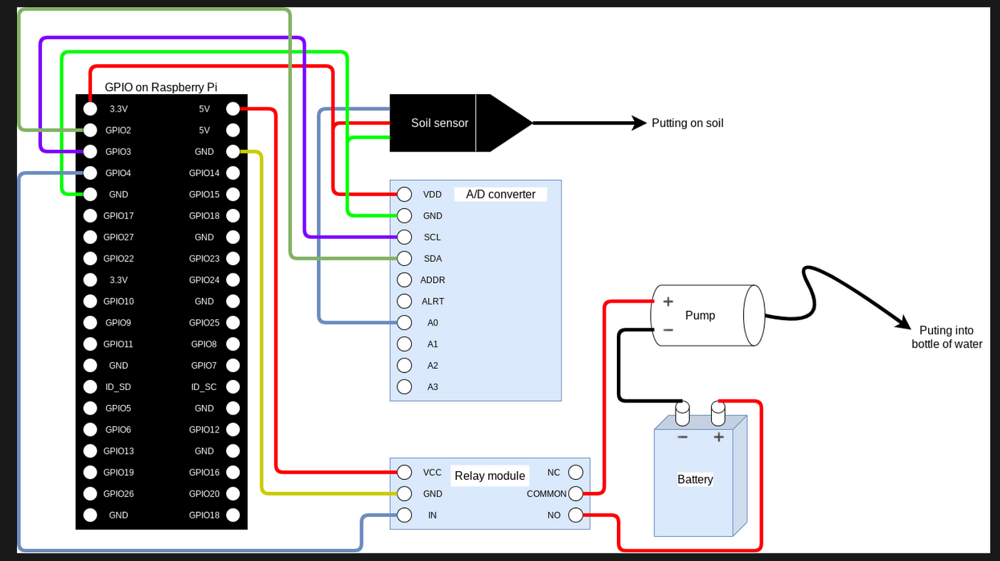

🌱 Osmo is an modular open-source and automated plant care system. We wanted to create a product that streamlines the plant care process. More importantly, we wanted to create something that can enable folks to have agency over their data and then be able to reflect on the performance of their data and hopefully keep their plants alive while doing so. Osmo is a project for all. We hope that farmers, gardeners, tinkerers, house-plant parents, dev's and DIYers can continually evolve this project. Osmo is modular, it has the ability to be scaled both vertically and horizontally. With the users needs being the fore-front of scale. 🌱 

Throughout the development of Osmo we kept three pillars in mind. Those three pillars are Sustainability, Accesability, and Privacy (SAP). These three pillars host issues that are ever so present in the post-industrial U.S food System. With climate change and current industrial agriculture practices negatively affecting growing seasons, soil quality and water supplies it is evident that a sustainable data-based solution is neccessary to mitigate these threats. Overall, we wanted to create a technology that can efficiently water plants, be accessible to all and enable folks to have agency over their data.

For starters, Osmo is a low-cost modular system equipped with sensors and powered by Raspberry Pi. Its sensors continuously monitor soil moisture and if the moisture level drops below the ideal threshold, Osmo's hydrates the soil until it reaches the optimum moisture level. The system sends soil moisture data and pump status to a web app, which provides a live stream of the plant. This data and live stream can be accessed via the internet from any personal device, such as a laptop or smartphone. Osmo provides an affordable and convenient way to monitor and care for plants remotely.

Below is the step-by-step set-up

## Cloudflare Zero Trust Setup

This project is protected by Cloudflare Zero Trust. 

### Prerequisites

- A Cloudflare account with access to the project's domain
- Cloudflare Access configured for your domain

### Steps

1. **Configure Access policies**: In the Cloudflare dashboard, navigate to the Access section and create an Access policy for the specific URL or subdomain where the Osmo application is hosted. Set the policy to allow only authenticated users or users belonging to specific groups.

2. **Install `cloudflared` on Raspberry Pi**: To use Cloudflare Zero Trust, you need to install the `cloudflared` daemon on your Raspberry Pi. Download the latest version of `cloudflared` for Raspberry Pi from the [official Cloudflare repository](https://developers.cloudflare.com/cloudflare-one/connections/connect-apps/install-and-setup/installation) and follow the installation instructions.

3. **Authenticate with Cloudflare Access**: Once `cloudflared` is installed, open a terminal window on your Raspberry Pi and run the following command to authenticate: cloudflared access login https://your-osmo-application-url


Replace `https://your-osmo-application-url` with the URL of your Osmo application. A browser window will open, prompting you to authenticate using your Cloudflare account or the configured identity provider.

4. **Connect to the application**: After successful authentication, `cloudflared` will establish a secure tunnel to your application. You can now access the Osmo application on your Raspberry Pi using the Cloudflare Zero Trust connection.

## Hardware Setup

This section outlines the steps to set up the required hardware components for the Osmo project on your Raspberry Pi.

### Components

- Raspberry Pi  4
- ADS1115
- Capacitive Moisture Sensor
- 4 Channel 5V Relay Module
- 5v submersible water pump
- Jumper Wires (20 M-F, 20 M-M, 20 F-F)
- 2 AA & AA battery holder with leads (perhaps upcycled from an old remote control)
- External power source (USB-C 5v)
- Micro-Sd Card
- Router/Wifi connection
- Solder Kit
- USB Camera 
- Monitor, Keyboard & Mouse**

### Steps

1. **Power off your Raspberry Pi**: Before connecting any hardware components, make sure your Raspberry Pi is powered off to avoid any electrical damage.

2. **Follow the diagram below for connecting Capacitative Moisture Sensor 




4. **Power on your Raspberry Pi**: Once all components are connected, power on your Raspberry Pi and proceed to run the Dockerized Osmo application as described in the "Running the Docker Image" section.

## Running the Docker Image

Follow these steps to build and run the Docker image for the Osmo project:

1. **Install Docker**: If you haven't already, install Docker on your raspberry pi. You can find the installation instructions for your specific operating system on the [official Docker documentation](https://docs.docker.com/get-docker/).

2. **Clone the repository**: Clone the Osmo project repository to your raspberry pi through cloudflare ssh and navigate to the project folder:


```bash
git clone https://github.com/TheThomasHoy/Osmo.git
cd Osmo
```


3. **Build the Docker image**: Build the Docker image using the provided Dockerfile. Replace `your-image-name` with a name of your choice:

```bash
docker build -t your-image-name .
```

4. **Run the Docker container**: Run the Docker container by mapping a local port (e.g., 4000) to the container's exposed port (e.g., 80). Replace `your-image-name` with the name you used in the previous step:

```bash
docker run -p 4000:80 your-image-name
```

5. **Access the application**: Open a web browser or a client application and navigate to ` https://your-osmo-application-url` 

Note: If you are running the Docker container on a Raspberry Pi with hardware components, make sure to follow the "Hardware Setup" section in the README before running the Docker container.


